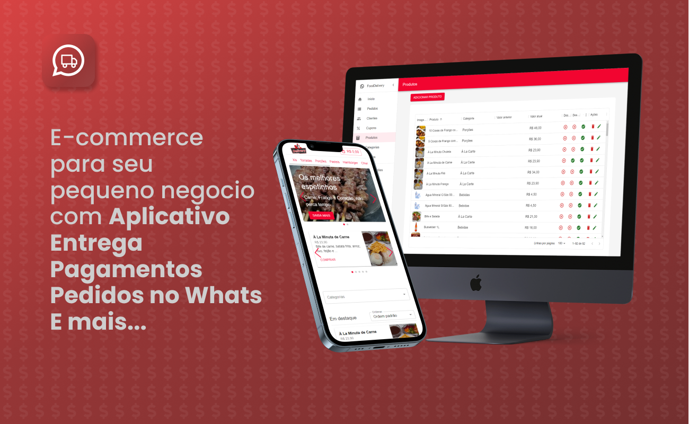

<a href="https://github.com/filipeleonelbatista/delivery-generic/blob/master/readme.md" target="_blank">
  
  Version in Brasilian Portuguese
</a>
</br>
</br>



# Index

- [About](#-about)
- [Technologies](#technologies)
- [Installation](#installation)

## 🔖&nbsp; About

E-commerce with Mobile App access control and User Responsibilities. Checkout via WhatsApp.

[Link to the project running on the WEB](https://mydeliveryapp.vercel.app/)

On the landing page you can access the dashboard and the main page. If it's down for any reason, you can try running it on your machine following the instructions in this document.

[Link to Landing page](https://mydeliveryapp.vercel.app/landing)

## Objective

I received an offer from an "investor" who wanted to make an app "like ifood" and obviously denied the proposal but became curious to try to develop and expand my knowledge.

Read more [IN THIS POST](https://www.linkedin.com/posts/filipeleonelbatista_empreendedorismo-tecnologia-firebase-activity-7112843992660082689-mQ6S?utm_source=share&utm_medium=member_desktop) on my Linkedin.

---

## Technologies

This project was developed with the following main technologies:

- [Typescript](https://www.typescriptlang.org/)
- [React JS](https://legacy.reactjs.org/docs/getting-started.html)
- [Firebase](https://firebase.google.com/?hl=en)
- [React Native](https://facebook.github.io/react-native/)
- [Expo](https://expo.io/)

and more...

---

## Installation

The project runs on [Node.js](https://nodejs.org/) v20+.

Instructions to install dependencies and start the project.

### Web

```sh
cd delivery-generic/web
npm i
npx run dev
```

### Mobile

```sh
cd delivery-generic/phone
npm i
npx run start
```

## Firebase Database

It's possible that the website is down or experiencing some issues, so it will be necessary to configure Firebase to run the application.

Remember to create an instance in Firebase and complete the Firebase configurations in the `firebase-config.ts` files in both applications located at `src/services/firebase-config.ts`

```ts
import { initializeApp } from "firebase/app";
import { getAuth } from "firebase/auth";
import { getFirestore } from "firebase/firestore";
import { getStorage } from "firebase/storage";

const firebaseConfig = {
  apiKey: "<YOUR KEY HERE>",
  authDomain: "<YOUR KEY HERE>",
  projectId: "<YOUR KEY HERE>",
  storageBucket: "<YOUR KEY HERE>",
  messagingSenderId: "<YOUR KEY HERE>",
  appId: "<YOUR KEY HERE>",
  measurementId: "<YOUR KEY HERE>",
};

const app = initializeApp(firebaseConfig);
export const authentication = getAuth(app);
export const db = getFirestore(app);
export const storage = getStorage(app);
```

---

<h3 align="center">Let's connect 😉</h3>
<p align="center">
  <a href="https://www.linkedin.com/in/filipeleonelbatista/">
    
  </a>&ensp;
  <a href="mailto:filipe.x2016@gmail.com">
    
  </a>&ensp;
  <a href="https://instagram.com/filipeleonelbatista">
    
  </a>
</p>
<br />
<p align="center">
    Developed 💜 by Filipe Batista 
</p>
