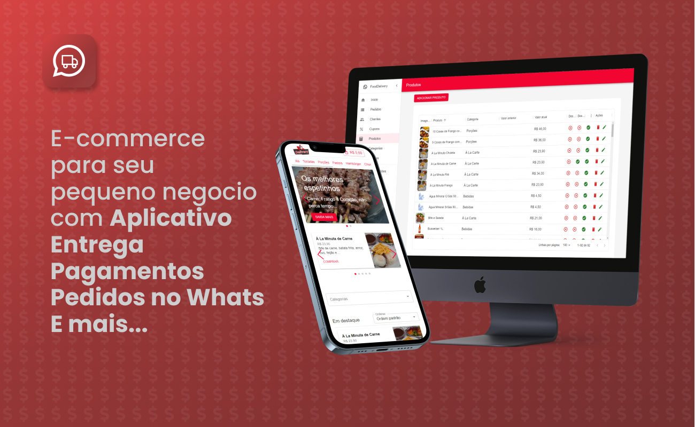

# Indice

- [Sobre](#-sobre)
- [Tecnologias](#Tecnologias)
- [Instalação](#Instalação)

## 🔖&nbsp; Sobre

E-comerce com App Mobile controle de acesso e Responsabilidades por usuários. Checkout via WhatsApp.

[Link do projeto rodando na WEB](https://mydeliveryapp.vercel.app/)

Na landing page você consegue acessar o painel e a pagina principal. Caso esteja fora por algum motivo você pode tentar
rodar na sua maquina seguindo as instruções deste documento.

[Link da Landingpage](https://mydeliveryapp.vercel.app/landing)

## Objetivo

Recebi uma oferta de um "investidor" que queria fazer um app "tipo ifood" e evidentemente neguei a proposta mas fiquei curioso
para tentar desenvolver e ampliar meus conhecimentos. 

Falo mais [NESTE POST](https://www.linkedin.com/posts/filipeleonelbatista_empreendedorismo-tecnologia-firebase-activity-7112843992660082689-mQ6S?utm_source=share&utm_medium=member_desktop) do meu Linkedin.
 
---
## Tecnologias

Esse projeto foi desenvolvido com as seguintes principais tecnologias:

- [Typescript](https://www.typescriptlang.org/)
- [React JS](https://legacy.reactjs.org/docs/getting-started.html)
- [Firebase](https://firebase.google.com/?hl=pt)
- [React Native](https://facebook.github.io/react-native/)
- [Expo](https://expo.io/)

e mais...

---
## Instalação

O projeto roda com [Node.js](https://nodejs.org/) v20+.

Instruções para instalar as dependencias e inicie o projeto.

### Web

```sh
cd delivery-generic/web
npm i
npx run dev
```

### Mobile

```sh
cd delivery-generic/phone
npm i
npx run start
```

## Base de dados no FIREBASE

É possivel que o site esteja fora do ar ou com algum problema então será necessário configurar o firebase
para poder rodar a aplicação.

Lembre de criar uma instancia no firebase e completar com as configurações do firebase nos arquivos `firebase-config.ts`
nas duas aplicações que fica em `src/services/firebase-config.ts`

```ts
import { initializeApp } from "firebase/app";
import { getAuth } from "firebase/auth";
import { getFirestore } from "firebase/firestore";
import { getStorage } from "firebase/storage";

const firebaseConfig = {
  apiKey: "<SUA CHAVE AQUI>",
  authDomain: "<SUA CHAVE AQUI>",
  projectId: "<SUA CHAVE AQUI>",
  storageBucket: "<SUA CHAVE AQUI>",
  messagingSenderId: "<SUA CHAVE AQUI>",
  appId: "<SUA CHAVE AQUI>",
  measurementId: "<SUA CHAVE AQUI>",
};

const app = initializeApp(firebaseConfig);
export const authentication = getAuth(app);
export const db = getFirestore(app);
export const storage = getStorage(app);
```

---

<h3 align="center" >Vamos nos conectar 😉</h3>
<p align="center">
  <a href="https://www.linkedin.com/in/filipeleonelbatista/">
    
  </a>&ensp;
  <a href="mailto:filipe.x2016@gmail.com">
    
  </a>&ensp;
  <a href="https://instagram.com/filipeleonelbatista">
    
  </a>
</p>
<br />
<p align="center">
    Desenvolvido 💜 por Filipe Batista 
</p>
